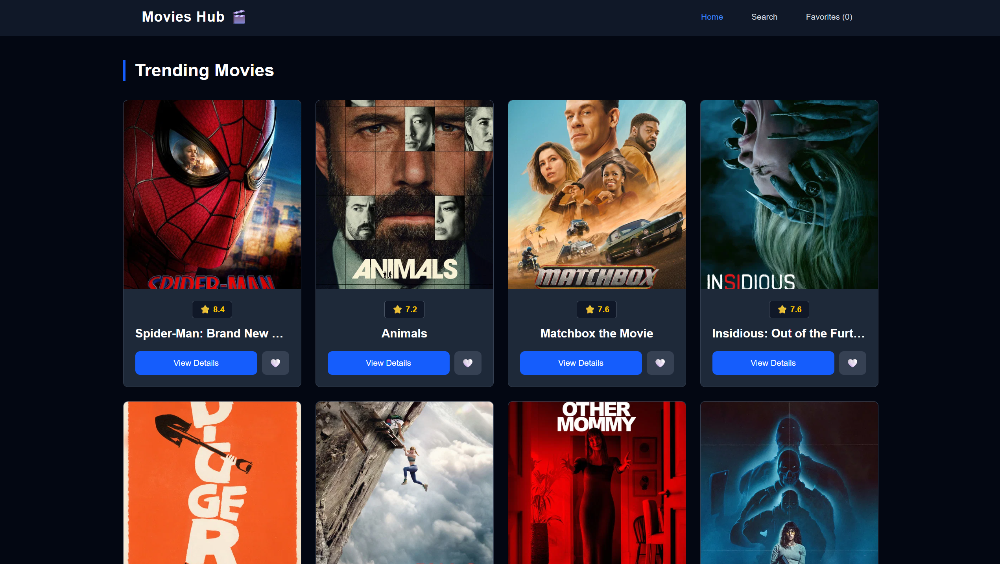
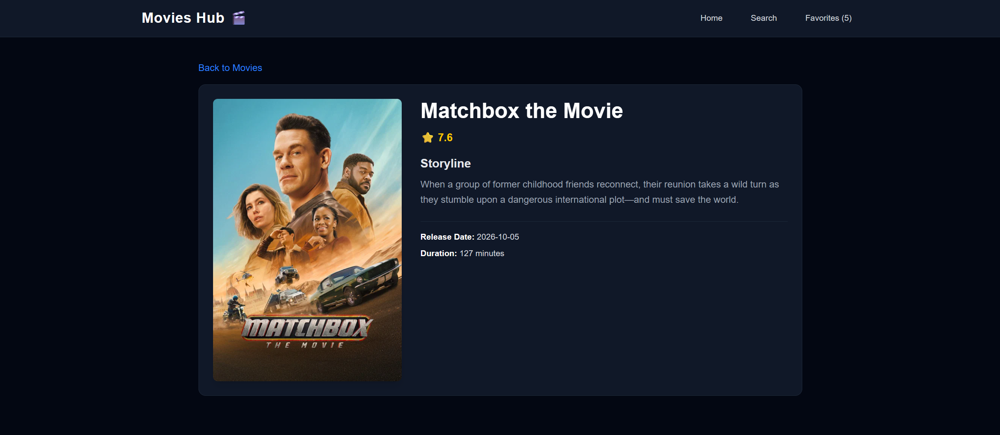
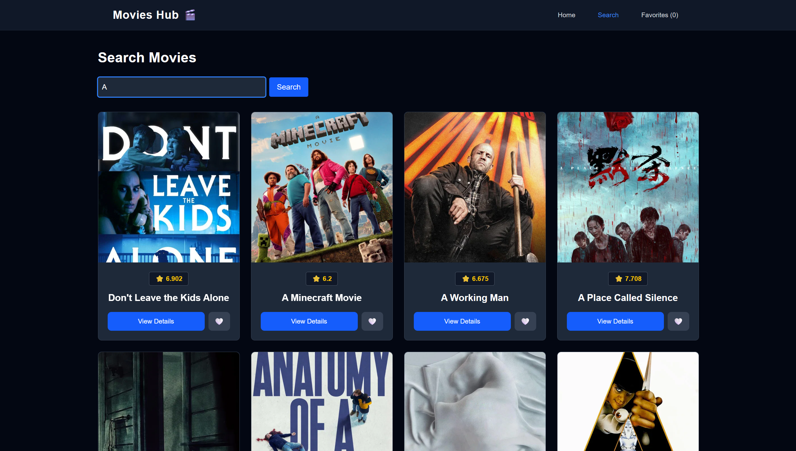
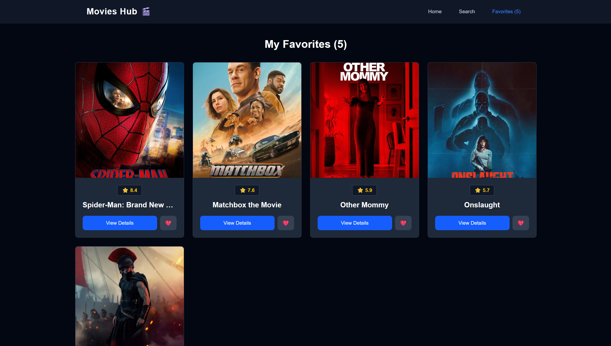

# Movies Hub

A responsive movie discovery web application built with React, Tailwind Css. It fetches movies data from TMDB API, allowing users to browse trending movies, search for specific titles, and save their favorites.

## Demo

- Live link: [Click Here](https://graduation-project-iti-three.vercel.app) 

## Screenshots

### Home Page


### Movie Details


### Search Page


### Favorites Page


## Features

- Display weekly trending movies from TMDB
- Search movies by title
- View movie details (rating, poster, and overview)
- Add/Remove movies from Favorites with localeStorage support.
- Fully responsive design with mobile menu.
- Auto scroll to top when navigating between pages

## Technologies Used

- React (Vite)
- Tailwind CSS
- React Router DOM
- Axios
- TMDB API

## How to run the project

1. Clone the repo:
```bash
git clone https://github.com/Abdelkhalek2/Graduation-Project-ITI.git 
```
2. Go to the project folder:
cd Graduation-Project-ITI

3. Install dependencies:
npm install

4. Run the development server:
npm run dev 

5. Open your browser at:
http://localhost:5173

